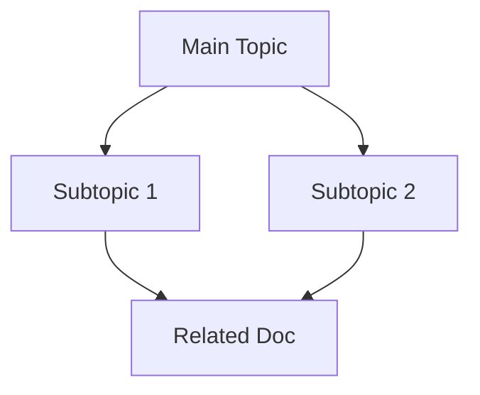

# Tapestry - Knowledge Networks

Interlink and summarize related documents into connected knowledge networks.

## When to Use
- Connecting related documents
- Building knowledge bases
- Summarizing document collections
- Creating reference networks
- Research synthesis

## Process

### 1. Identify Documents
Gather related documents:
- Notes
- Articles
- Meeting notes
- Research papers
- Code documentation

### 2. Extract Key Concepts

For each document:
- Main topics
- Key terms
- Related concepts
- References to other docs

### 3. Create Links

```markdown
# Document: [Title]

## Key Concepts
- [[Concept A]]
- [[Concept B]]

## Related Documents
- [[Document X]] - [relationship]
- [[Document Y]] - [relationship]

## Summary
[Brief summary]
```

### 4. Build Network Map



### 5. Create Index

```markdown
# Knowledge Index

## Topics
- [[Topic A]] - Main concept
  - Related: [[X]], [[Y]], [[Z]]
  
- [[Topic B]] - Secondary concept
  - Related: [[A]], [[C]]

## Document Registry
| Document | Type | Topics |
|----------|------|--------|
| Doc 1 | Note | A, B |
| Doc 2 | Article | B, C |
```

## Metadata Format

```yaml
---
title: Document Title
created: 2024-01-15
tags: [topic1, topic2]
related:
  - doc-a
  - doc-b
---
```

## Benefits

- **Discoverability** - Find related info faster
- **Context** - Understand relationships
- **Synthesis** - See patterns across docs
- **Navigation** - Easy traversal
