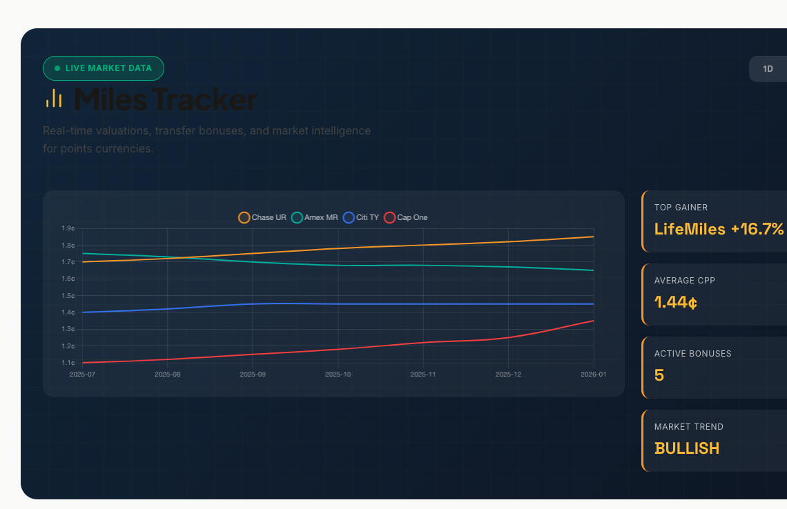
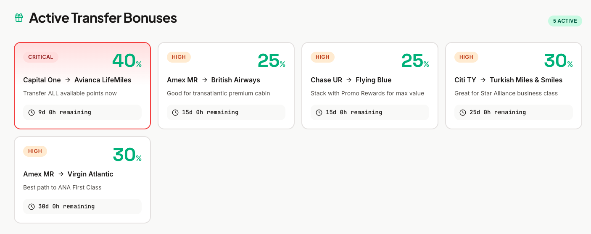
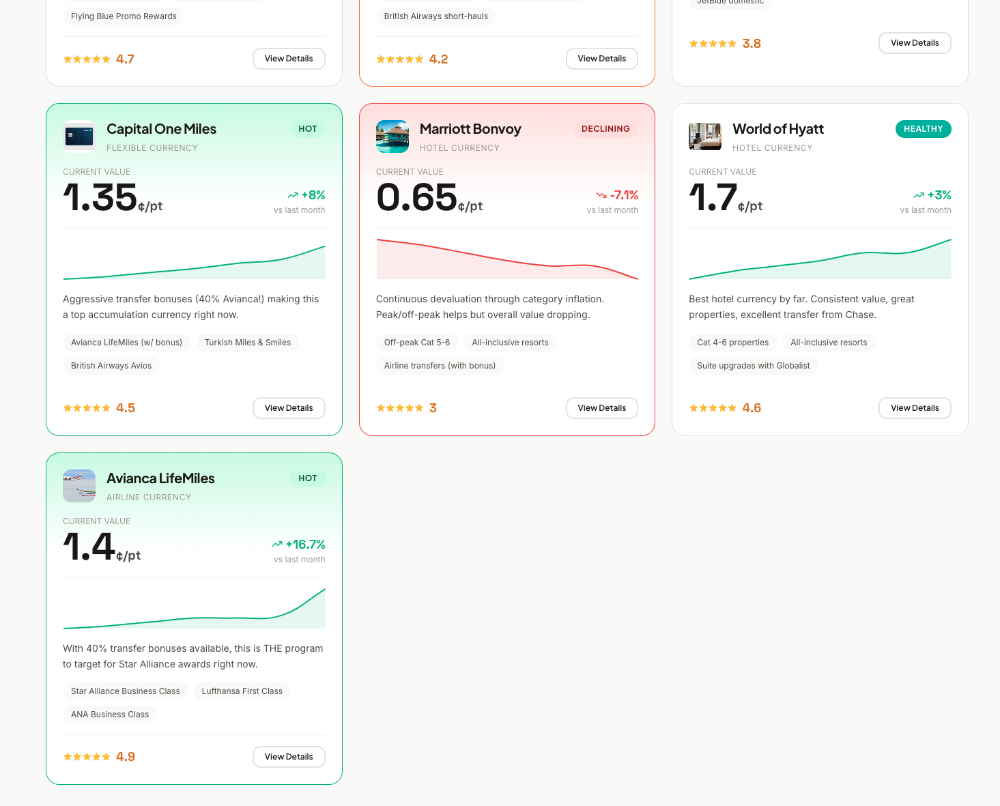
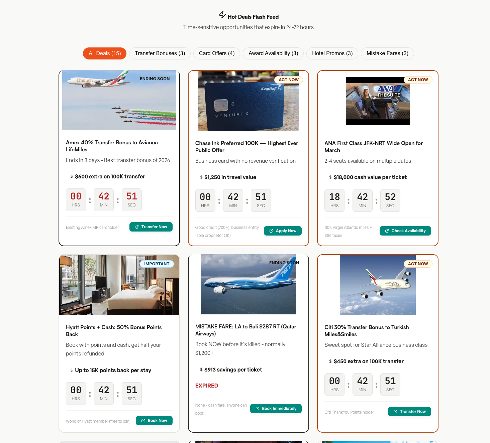
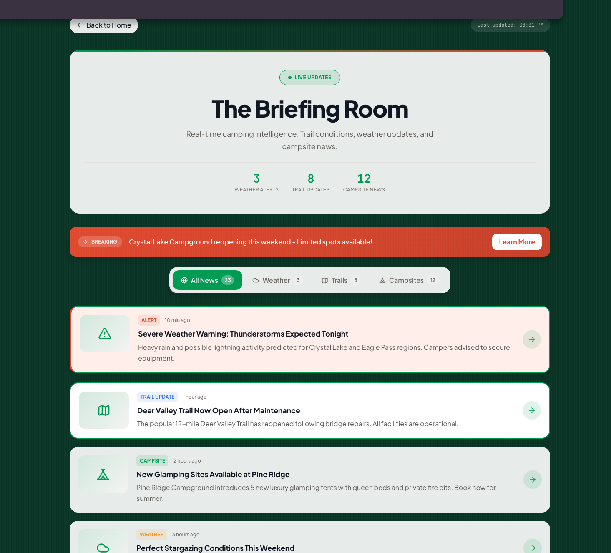

http://localhost:8000/tools/miles-tracker.html

comentário: não está bem adequado visualmente, fonte escura com fundo escuro, o grafico está feio, o design ruim.

comentário: deveria ter mais uma ou duas linhas de conteudo dando melhor contexto e explicação ficando mais harmonico com o site, e esse bloco sempre deve ser responsivo.

comentário: ache solução de design para os campos que não tiverem todos os cards/blocos nao aparecerem pra pessoa tocar em ver mais, se por acaso nao tiver volume, ai pode mostrar o espaço em branco, fala o mesmo no caso da imagem anterior.

comentário: pense melhor nos elementos desse card para ele ter link

http://localhost:8000/news/hot-deals-flash.html

comentário: reimagine essa pagina alinhada com o design padrão do site feito na sua ultima tarefa.

Abaixo estáo as paginas que não estão adequadas conforme a identidade padrão, as referencias, elas devem estar no modo white e nao dark igual a identidade padrão.
/intelligence/devaluation-clock.html
/intelligence/sweet-spot-explorer.html
/intelligence/first-class-roulette.html
/intelligence/card-stacking-wizard.html
/intelligence/community-pulse.html (melhore e reimagine a UX, e adicione a forma da pessoa adicionar um comentario, ou vitoria, etc...)

As paginas abaixo vc deove reformular o design alinha com identidade e adicionar mais elementos, reimaginar pra conter mais conteudo, alterar e melhorar, e o mais importante, deixar alinhado com a identidade padrão das referencias e do site.
/evergreen/hacks-library.html
/evergreen/quick-guides.html
/feeds/deal-alerts.html
/feeds/live-ticker.html
/feeds/program-updates.html
/feeds/success-stories.html
/news/hot-deals-flash.html (faça dinamico, com os principais em cima depois uma solucao de design mais compacta e expansivel, crie filtros mais elaborados e mais interativos reimagine toda essa estrutura, remova os contadores, coloque apenas o destaque para uma data de validade de até qunado é possível)
/news/community-wins.html (REIMAgine a UX melhore os elementos)
/news/transfer-bonus-tracker.html
/news/market-pulse-weekly.html (REIMAGINE e adicione mais dinamica nos estilo, podendo conter imagens, e textos e formatos diferentes, porém segunido a mesma estrutura e modelo e deixe mais alinhado com a identidade padrão)
/news/card-universe-feed.html

/news/news-portal.html

comentário: se atente as imagensm e crie o destino para quando o usuario toca para ver

Remova da aplicação todas as páginas abaixo listadas, elas não são mais necessarias.

/intelligence/war-room.html
/intelligence/arbitrage-matrix.html
/intelligence/velocity-engine.html
/intelligence/burn-or-bank.html
/intelligence/redemption-simulator.html